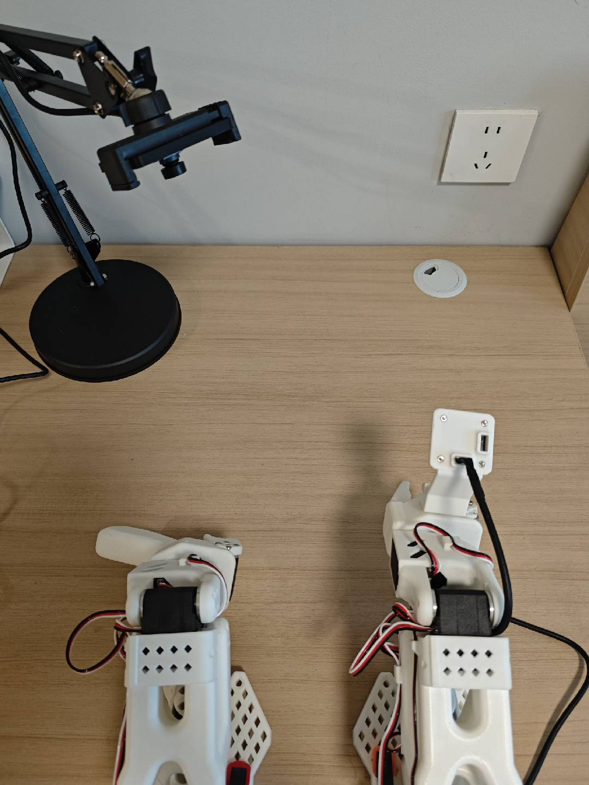

# On-Practice-VLA

On-Practice-VLA 是一个面向实践驱动迭代的研究项目仓库，用于整理视觉-语言-动作（Vision-Language-Action，VLA）模型及相关基础组件的学习内容、经典方案参考和实践材料。

> 项目仍在持续完善中，示例代码和文档会随着实验进展逐步补充。

## 仓库结构

| 目录 | 内容 |
| --- | --- |
| [`basic_knowledge/`](./basic_knowledge/) | VLA 相关基础知识和常见技术栈的学习示例 |
| [`basic_knowledge/mujoco/`](./basic_knowledge/mujoco/) | 从 MuJoCo 基础仿真到轨迹数据的渐进式示例 |
| [`basic_knowledge/transformer/`](./basic_knowledge/transformer/) | 基于 PyTorch 的 Transformer 英译意示例 |
| [`basic_knowledge/vae/`](./basic_knowledge/vae/) | 基于 PyTorch 的卷积变分自编码器示例 |
| [`basic_knowledge/resnet/`](./basic_knowledge/resnet/) | ResNet 相关学习代码 |
| [`source/`](./source/) | VLA 数据加载、训练和推理实验代码 |
| [`pic/`](./pic/) | 项目图片和实验记录 |

## 硬件

当前硬件记录如下，后续会补充设备型号、显存、控制器和实验用途等信息。



## 基础知识学习路线

建议按照以下方向逐步学习：

- **视觉与表征**：ViT、ResNet、CLIP、JEPA
- **序列建模**：Transformer、SSM
- **生成建模**：VAE、Diffusion
- **策略优化**：行为克隆、DPO、RLHF 和强化学习
- **训练与分布式**：DeepSpeed、FSDP、LoRA
- **数据集与格式**：LeRobot、RLDS、UMI 等

各子目录中的 README 会说明对应示例的依赖、配置和运行方式。

## 经典方案参考

### VLA 与机器人策略

- [ACT](https://tonyzhaozh.github.io/aloha/)
- [OpenVLA](https://openvla.github.io/)
- [Diffusion Policy](https://diffusion-policy.cs.columbia.edu/)
- StarVLA
- PI 系列（Physical Intelligence）
- GROOT

### 延伸资料

- [Gemini Robotics — Google DeepMind](https://deepmind.google/models/gemini-robotics/)
- [Gen-1.5 — Generalist AI](https://generalistai.com/blog/gen-1.5)
- [LeRobot MuJoCo Tutorial](https://github.com/jeongeun980906/lerobot-mujoco-tutorial)

## MuJoCo 学习

从 [MuJoCo 渐进式学习文档](./basic_knowledge/mujoco/README.md) 开始，按以下顺序学习：

```text
XML 建模 → 仿真状态 → 动作控制 → 接触与传感器 → 相机观测 → Gymnasium 环境 → 轨迹数据
```

该目录包含六个可独立运行的示例，覆盖自由落体、关节控制、接触传感器、相机渲染、Gymnasium 环境和轨迹数据。详细的环境准备、运行命令、常见问题及其与 LeRobot 教程的对应关系，请参考该目录的 README。

## 环境要求

根项目的 [`project.toml`](./project.toml) 声明了 Python `3.10` 环境及 VLA 实验所需的主要依赖。不同学习模块可能有独立的依赖和 Python 版本要求，请优先按照对应目录中的说明创建虚拟环境并安装依赖。

例如，运行 MuJoCo 示例：

```bash
cd basic_knowledge/mujoco
python -m venv .venv
source .venv/bin/activate  # Windows：.venv\Scripts\activate
pip install -r requirements.txt
python 01_free_fall.py
```

Transformer、VAE 等模块的详细安装和运行方式分别见：

- [Transformer README](./basic_knowledge/transformer/README.md)
- [VAE README](./basic_knowledge/vae/README.md)
